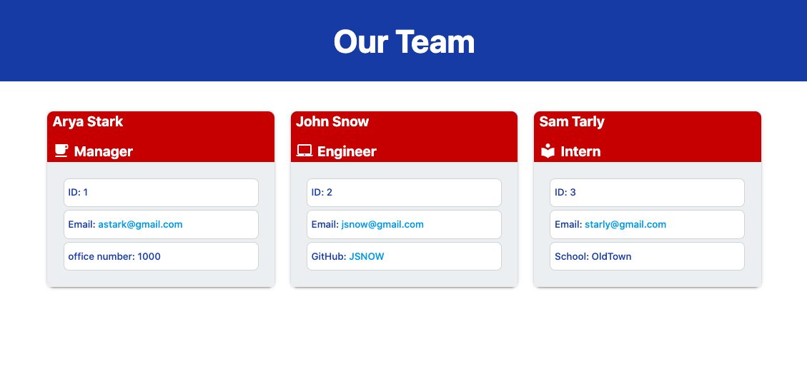

  # My Team Page
  # Description
  A Node.js command-line application that collects information regarding employees on a software engineering team and generates an HTML webpage that displays information for each team member.

  ### Table of Contents
  * [Installation](#installation)
  * [Usage](#usage)
  
  
  * [Questions](#questions)

  ## Installation
  In order to produce this webpage for your team, after cloning the repo and running the npm install command from the terminal, run the node index command, answer the prompts with the relevant information for the different team members. 
  
  ## Usage
  Stepts how to run the application are available in the following demo: 

  A webpage produced from the demo above:
  

  

  
  
 ## Questions
  
  * Got questions? [email me](mailto:caspi.home@gmail.com) 
  * [My GitHub profile](https://github.com/hcs847)
      